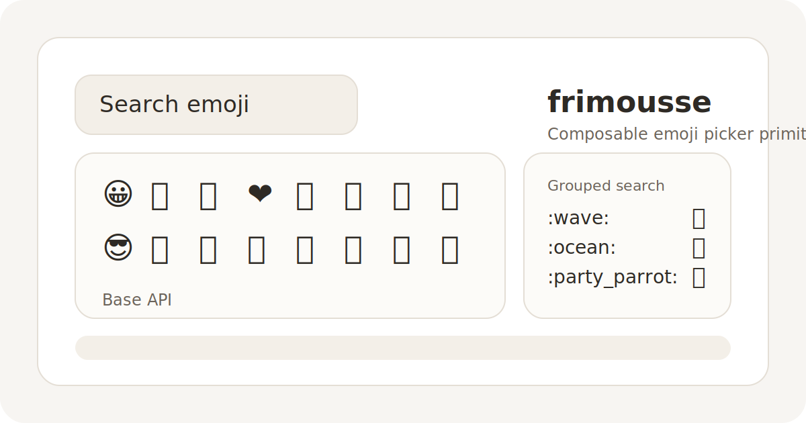

<h1>
  <a href="https://github.com/mjcampagna/frimousse">
    
  </a>
  <a href="https://github.com/mjcampagna/frimousse">
    
  </a>
</h1>

[](https://github.com/mjcampagna/frimousse/actions/workflows/tests.yml)
[](https://github.com/mjcampagna/frimousse/blob/main/LICENSE)

A lightweight, unstyled, and composable emoji picker for React.

- ⚡️ **Lightweight and fast**: Dependency-free, tree-shakable, and virtualized with minimal re-renders
- 🎨 **Unstyled and composable**: Bring your own styles and compose parts as you want
- 🔄 **Always up-to-date**: Latest emoji data is fetched when needed and cached locally
- 🔣 **No � symbols**: Unsupported emojis are automatically hidden
- ♿️ **Accessible**: Keyboard navigable and screen reader-friendly

 

## Fork purpose

This repository is a compatibility-conscious fork of Frimousse.

The goal of the fork is:

- preserve the baseline picker contract for existing consumers
- add generally useful extension seams rather than app-specific behavior
- keep fork changes additive and easy to reason about
- keep future upstream rebases practical by isolating new behavior where possible

Current fork additions include:

- mixed consumer-defined sections
- widened selection APIs
- consumer-owned frequency helpers
- image-backed custom emoji helpers
- shortcode display helpers
- native search enrichment and unified mixed-item search

The upstream project remains the baseline reference for the original picker composition model. Repository-specific extensions are documented separately in [guides/extensions.md](./guides/extensions.md).

The intended published package identity for this fork is `@slithy/frimousse`.

## Installation

Once published, install the package with:

```bash
pnpm add @slithy/frimousse
```

Until the scoped package is published, install directly from the repository:

```bash
pnpm add github:mjcampagna/frimousse
```

To adopt the fork, consumers should only need to swap the import source:

```tsx
import { EmojiPicker } from "@slithy/frimousse";
```

The upstream hosted installer and examples are not the canonical distribution channel for this fork.

## Usage

Import the `EmojiPicker` parts and create your own component by composing them.

```tsx
import { EmojiPicker } from "@slithy/frimousse";

export function MyEmojiPicker() {
  return (
    <EmojiPicker.Root>
      <EmojiPicker.Search />
      <EmojiPicker.Viewport>
        <EmojiPicker.Loading>Loading…</EmojiPicker.Loading>
        <EmojiPicker.Empty>No emoji found.</EmojiPicker.Empty>
        <EmojiPicker.List />
      </EmojiPicker.Viewport>
    </EmojiPicker.Root>
  );
}
```

Apart from a few sizing and overflow defaults, the parts don’t have any styles out-of-the-box. Being composable, you can bring your own styles and apply them however you want: [Tailwind CSS](https://tailwindcss.com/), CSS-in-JS, vanilla CSS via inline styles, classes, or by targeting the `[frimousse-*]` attributes present on each part.

You might want to use it in a popover rather than on its own. Frimousse only provides the emoji picker itself so if you don’t have a popover component in your app yet, there are several libraries available: [Radix UI](https://www.radix-ui.com/primitives/docs/components/popover), [Base UI](https://base-ui.com/react/components/popover), [Headless UI](https://headlessui.com/react/popover), and [React Aria](https://react-spectrum.adobe.com/react-aria/Popover.html), to name a few.

## Documentation

The upstream documentation site remains useful for the baseline picker composition model, but it does not document the fork-specific extensions in this repository.

Baseline upstream docs and examples:

- [frimousse.liveblocks.io](https://frimousse.liveblocks.io)

Additional repository-specific extension guidance for mixed sections, frequent items, custom emoji helpers, and widened selection APIs lives in [guides/extensions.md](./guides/extensions.md).

## Compatibility

- React 18 and 19
- TypeScript 5.1 and above

## Miscellaneous

The name [“frimousse”](https://en.wiktionary.org/wiki/frimousse) means “little face” in French, and it can also refer to smileys and emoticons.

The emoji picker component was originally created for the [Liveblocks Comments](https://liveblocks.io/comments) default components, within [`@liveblocks/react-ui`](https://github.com/liveblocks/liveblocks/tree/main/packages/liveblocks-react-ui).

## Credits

The emoji data is based on [Emojibase](https://emojibase.dev/).

## Contributing

All contributions are welcome! If you find a bug or have a feature request, feel free to create an [issue](https://github.com/mjcampagna/frimousse/issues) or a [PR](https://github.com/mjcampagna/frimousse/pulls).

The project is setup as a monorepo with the `frimousse` package at the root, a static website in `website`, and companion packages in `packages/*`.

### Development

Install dependencies and start development builds from the root.

```bash
pnpm install
pnpm dev
```

The static website can be developed separately.

```bash
pnpm dev:website
```

### Tests

The package has 95%+ test coverage with [Vitest](https://vitest.dev/). Some tests use Vitest’s [browser mode](https://vitest.dev/guide/browser-testing) with [Playwright](https://playwright.dev/), make sure to install the required browser first.

```bash
pnpm exec playwright install chromium
```

Run the tests.

```bash
pnpm test:coverage
```

### Releases

Releases are managed manually with [Changesets](https://github.com/changesets/changesets).

Typical release flow:

```bash
pnpm changeset
pnpm changeset version
pnpm release:check
npm_config_userconfig=~/.npmrc pnpm changeset publish
```

If publish fails with `ENEEDAUTH`, make sure the command is running in a shell
that can read your `~/.npmrc`, or keep the `npm_config_userconfig=~/.npmrc`
prefix shown above.

Continuous preview releases are still automatically triggered for every commit
in PRs via [pkg.pr.new](https://github.com/stackblitz-labs/pkg.pr.new).
